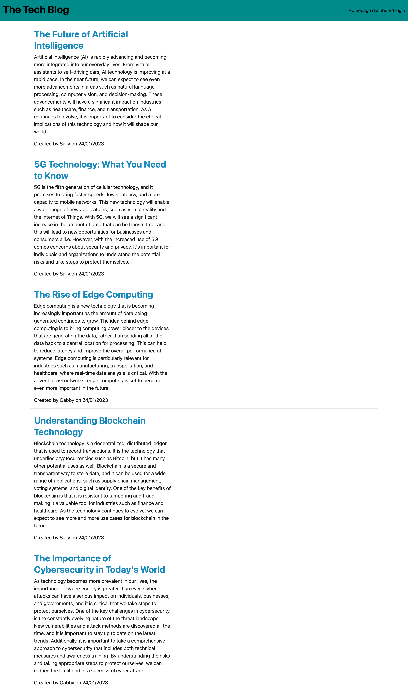

# The Tech Blog

Full Stack Build | development and deployment of a tech blog

---

**Table of Contents:**

* [Description](#description)
* [User Story](#user-story)
* [Acceptance Criteria](#acceptance-criteria)
* [Installation](#installation)
* [Testing](#testing)
* [Using the code](#using-the-code)
* [Tech Blog Deployment](#the-tech-blog-deployment)
    * [Screenshot of deployed application](#screenshot-of-the-deployed-application)
    * [Link to deployed application](#link-to-deployed-application)
* [Usage](#usage)
* [License](#license) 
* [Questions](#questions)

---

## Description

We wanted to build a full stack application that allows users to search for technology based blog posts.

Using node.js and express JS to create a RESTful API, Sequelize and MySQL to manage the databases and sensitive user data, such as password encryption and session cookies, npm package manager and handlebars for HTML rendering.


## User Story

```md
AS A developer who writes about tech
I WANT a CMS-style blog site
SO THAT I can publish articles, blog posts, and my thoughts and opinions
```

## Acceptance Criteria

```md
GIVEN a CMS-style blog site
WHEN I visit the site for the first time
THEN I am presented with the homepage, which includes existing blog posts if any have been posted; navigation links for the homepage and the dashboard; and the option to log in
WHEN I click on the homepage option
THEN I am taken to the homepage
WHEN I click on any other links in the navigation
THEN I am prompted to either sign up or sign in
WHEN I choose to sign up
THEN I am prompted to create a username and password
WHEN I click on the sign-up button
THEN my user credentials are saved and I am logged into the site
WHEN I revisit the site at a later time and choose to sign in
THEN I am prompted to enter my username and password
WHEN I am signed in to the site
THEN I see navigation links for the homepage, the dashboard, and the option to log out
WHEN I click on the homepage option in the navigation
THEN I am taken to the homepage and presented with existing blog posts that include the post title and the date created
WHEN I click on an existing blog post
THEN I am presented with the post title, contents, post creator’s username, and date created for that post and have the option to leave a comment
WHEN I enter a comment and click on the submit button while signed in
THEN the comment is saved and the post is updated to display the comment, the comment creator’s username, and the date created
WHEN I click on the dashboard option in the navigation
THEN I am taken to the dashboard and presented with any blog posts I have already created and the option to add a new blog post
WHEN I click on the button to add a new blog post
THEN I am prompted to enter both a title and contents for my blog post
WHEN I click on the button to create a new blog post
THEN the title and contents of my post are saved and I am taken back to an updated dashboard with my new blog post
WHEN I click on one of my existing posts in the dashboard
THEN I am able to delete or update my post and taken back to an updated dashboard
WHEN I click on the logout option in the navigation
THEN I am signed out of the site
WHEN I am idle on the site for more than a set time
THEN I am able to view comments but I am prompted to log in again before I can add, update, or delete comments
```

Challenges in this project: I had some challenges with the model associations, but with some online research and furhter reading i was able to figure them out.
I am pleased with how the controller routes turned out and how i have implemented the MVC paradigm. 


## Installation

Start by downloading the code from the repository, then load in VS code, open a terminal and make sure you are in the project folder.
Initialise the code by typing into the terminal:
```bash
npm i

add your sql credentials the .envEXAMPLE file and rename the file to .env
```

## Using the code

To initialise the database you will need to run the following commands in the terminal to seed the database and run up the program:

- Login to mySQL and initialise the database

```bash
mysql -u root -p
source db/schema.sql
quit;
```
- Then seed the database
```bash
npm run seed
```

- To get the database and site running locally you will need to enter into the terminal:
```bash
npm run start
```
go to your web browser and enter, 

```http://localhost:3001``` 

the site should be running and you will able to interact with the database via the front end.

Once you have finished using the site and database, be sure to run *(ctrl+C)* or *(^C)* to close down the session.

The code files are fully commented, to explain the flow and logic of the code, so that others can work on this and expand on it too.


## The Tech Blog deployment

### Screenshot of the deployed application.



### Link to deployed application.

<a href="https://protected-hollows-97045.herokuapp.com/"><b>Link to the deployed tech blog</b></a>


## Usage

This code can be used as an example of how to build a full stack application using the technologies layed out in the description, if you have any questions or suggestions, please let  know using the links in the [questions](#questions) section of this README.

## License

NA

## Questions

If you have any questions, reach out [@enigmawoman](https://github.com/enigmawoman)</br>


